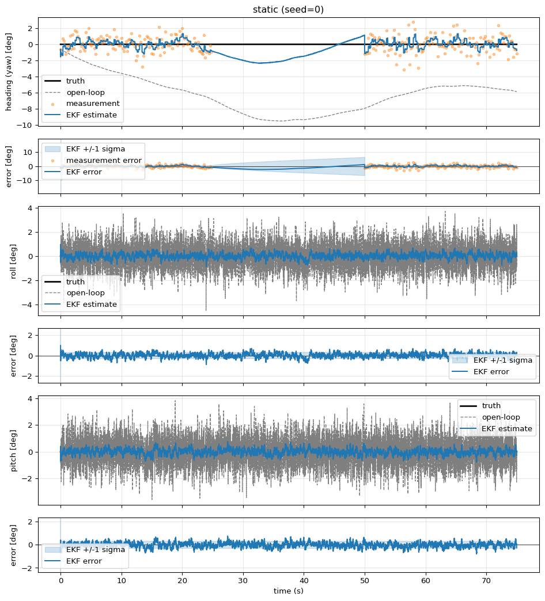
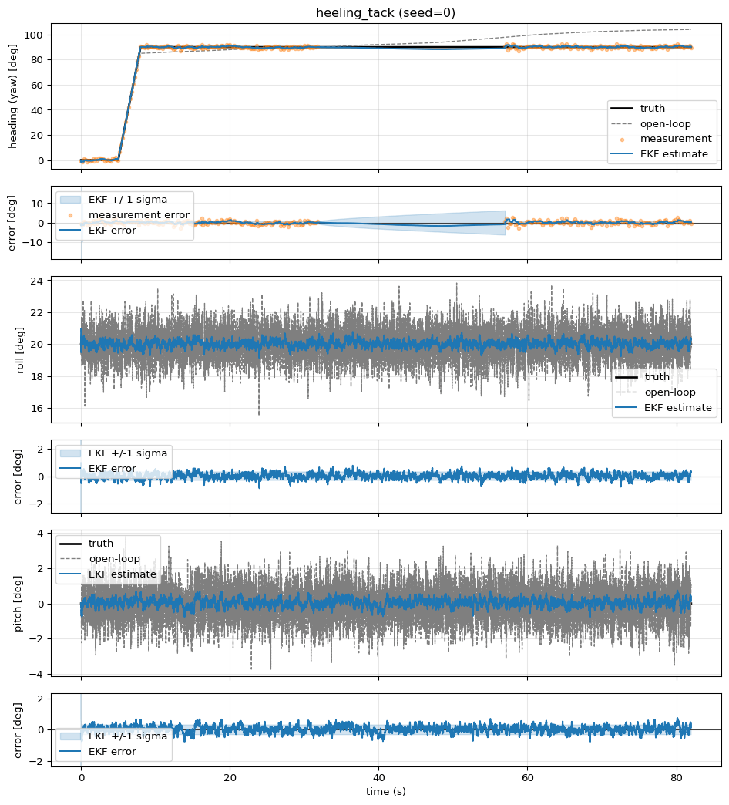
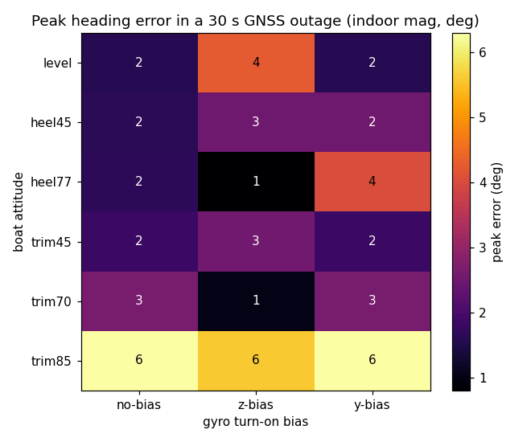

# Polaris IMU

[](https://github.com/UBCSailbot/PLRS-IMU/actions/workflows/ci.yml)
[](LICENSE)
[](https://en.cppreference.com/w/cpp/23)
[](https://datasheets.raspberrypi.com/rp2040/rp2040-datasheet.pdf)

This repository contains the IMU firmware for Polaris.

## Setup

This project's toolchain is based on [PlatformIO](https://platformio.org/),
configured for the RP2040.

### Nix

A dev shell is provided in `flake.nix`. If you use
[direnv](https://direnv.net/), it will load automatically when you enter the
directory. Otherwise:

```bash
nix develop
```

### Linux

Install Nix using the Determinate installer:

```bash
curl --proto '=https' --tlsv1.2 -sSf -L https://install.determinate.systems/nix | sh -s -- install
mkdir -p ~/.config/nix/
echo "experimental-features = nix-command flakes" >> ~/.config/nix/nix.conf
```

Then install direnv through Nix (the apt package is too old to support `use flake`):

```bash
nix profile add nixpkgs#direnv
echo '# Direnv shell hook'
echo 'eval "$(direnv hook bash)"' >> ~/.bashrc
exec bash
direnv allow
```

### macOS

Install Nix using the Determinate installer:

```bash
curl --proto '=https' --tlsv1.2 -sSf -L https://install.determinate.systems/nix | sh -s -- install
mkdir -p ~/.config/nix/
echo "experimental-features = nix-command flakes" >> ~/.config/nix/nix.conf
```

Then install direnv through Nix:

```bash
nix profile add nixpkgs#direnv
echo '# Direnv shell hook'
echo 'eval "$(direnv hook zsh)"' >> ~/.zshrc
exec zsh
direnv allow
```

### Windows

The recommended path is WSL2 with Ubuntu 24.04. Install WSL2 from PowerShell:

```powershell
wsl --install -d Ubuntu-24.04
```

Once in WSL, follow the [Linux](#linux) instructions above.

For flashing, the RP2040 needs to be forwarded from Windows into WSL using
[usbipd-win](https://github.com/dorssel/usbipd-win):

```powershell
usbipd list                  # find the RP2040 bus ID
usbipd bind --busid <id>
usbipd attach --wsl --busid <id>
```

### Set up Git and GitHub

Skip this section if you've already configured git and your GitHub credentials.

#### Configure Git:

```bash
git config --global user.email "you@example.com"
git config --global user.name "Your Name"
git config --global core.autocrlf false # Very important you don't miss this on WSL!
```

#### Configure the gh Helper (For Logging Into GitHub):

Linux:

```bash
sudo apt update && sudo apt install gh
```

macOS:

```bash
brew install gh
```

Then authenticate:

```bash
gh auth login
```

### Build, test, and flash

```bash
make test    # host Unity tests
make build   # build firmware
make upload  # flash the RP2040
make format  # clang-format all sources in-place
```

Run `make` with no arguments to list all targets.

### Python sim

A Python harness at `sim/` runs the C++ EKF offline for visualization and
tuning; the same filter that ships on the RP2040 runs in the sim, so tuning
values transfer faithfully.

`make tui` drops into an arrow-key picker; choose a view, then a scenario.

The timeseries view plots truth, measurements, the EKF estimate, and the
open-loop gyro integration per channel, with residuals and a +/-1 sigma band
below. Three runs show the fusion holding heading where raw integration cannot.

**Held through a GNSS outage**: fixes drop from 25 to 50 s; the open-loop gyro
integration peels away while the EKF, having learned the gyro bias, stays near
truth and re-anchors the instant fixes resume:



**...and at heel**: the same outage at 20 deg heel with a body-Y gyro bias, the
lever behind heel-dependent heading drift. The 3-axis bias state observes and
removes it, where the old vertical-only filter would ramp:



**Across the envelope**: peak heading error over a 30 s outage for every boat
attitude and turn-on bias (indoor mag). The sailing rows stay within a few
degrees; only near-vertical bench trim, where the ZYX heading kinematics are
singular, goes hot (`uv run python examples/drift_sweep.py`):



The **mounting** view renders the calibration geometry from tuning.toml, and
**simulate**/**pose** show the 3D boat (truth, EKF estimate, raw IMU) as a GIF
or a static filmstrip.

```bash
make tui                                        # interactive picker
make tui SCENARIO=wave_tack VIEW=timeseries     # skip the picker
make sim-test                                   # pytest suite
make sim-format                                 # ruff format + check
```

Noise, EKF, and calibration flags are available on the direct CLI; see
`cd sim && uv run python -m plrs_sim sim --help`.

### Git hooks

Pre-push hooks are tracked in `hooks/` and mirror the CI checks (clang-format
+ native tests). If you use direnv, they are installed automatically when you
enter the directory. Without direnv, install them once manually:

```bash
ln -sf ../../hooks/pre-push .git/hooks/pre-push
```

## Coding style

See [CONTRIBUTING.md](CONTRIBUTING.md).

## Overview

The goal is heading accuracy of ≤2° on Polaris by fusing IMU and GNSS
measurements through a Kalman filter (likely an Extended Kalman Filter given
time constraints).

### Reference Projects

[TinyEKF](https://github.com/simondlevy/TinyEKF): Lightweight C/C++ Extended
Kalman Filter.

## Tuning

Filter tuning lives in [tuning.toml](tuning.toml), shared by the firmware and
the sim. See [docs/tuning.md](docs/tuning.md) for theory, datasheet-derived
starting values, and the record-and-replay workflow.

## Hardware

MCU:
[Raspberry Pi RP2040](https://datasheets.raspberrypi.com/rp2040/rp2040-datasheet.pdf)

MEMS IMU (accelerometer, gyroscope, magnetometer):
[Xsens MTi-3-5A-T](https://mtidocs.xsens.com/mti-1-series)

GNSS kit (dual antenna):
[Septentrio mosaic-go H](https://shop.septentrio.com/en/shop/mosaic-go-h-heading-gnss-module-evaluation-kit)

## Firmware

[FreeRTOS](https://www.freertos.org/)

## Roadmap

| Milestone | Issues |
|---|---|
| [Python Logger](https://github.com/UBCSailbot/PLRS-IMU/milestone/1) | Serial capture script, log format, replay utility |
| [Python EKF Sim](https://github.com/UBCSailbot/PLRS-IMU/milestone/2) | pybind11 bindings, synthetic data generator, sim runner, plotter |
| [HIL Testing](https://github.com/UBCSailbot/PLRS-IMU/milestone/3) | On-device test suite, PIO Remote agent, CI integration |

## License

[GNU General Public License v3.0](LICENSE)
