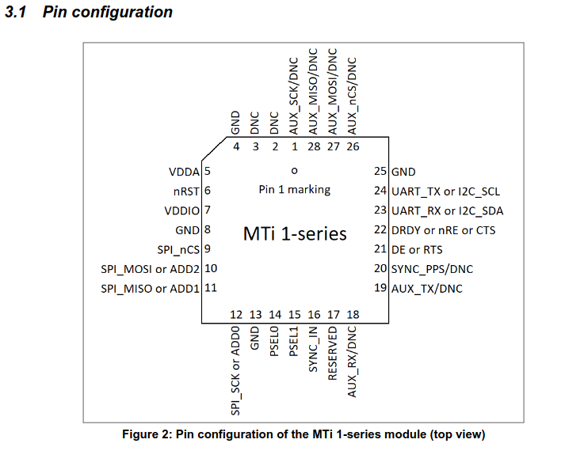

# IMU wiring (MTi-3)

UART full-duplex mode (PSEL1=0, PSEL0=0). 8N1, 115200 baud.

| MTi-3 pin | Signal | Connect to |
|---|---|---|
| 5 | VDDA | 3.3V |
| 7 | VDDIO | 3.3V |
| 4, 8, 13, 25 | GND | GND |
| 14 | PSEL0 | GND |
| 15 | PSEL1 | GND |
| 23 | UART_RX | RP2040 GP16 |
| 24 | UART_TX | RP2040 GP17 |
| 22 | CTS | GND |
